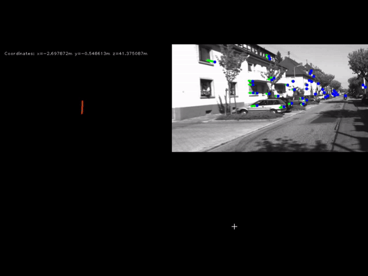

# Stereo_Visual_Odometry
Real time Stereo Visual Odometry in Python.

The algorithm consists of several blocks that include feature exrtraction, robust feature tracking, motion estimation, and RANSAC. The algorithm has low computational requirements and can run real-time.

## Launching
---
To test the system, copy KITTI sequence 00 to the project path, including the images, the calibration, and the ground truth.

Then run:

`python ./SVO.py`

After this, a window similar as the one below will be shown.
 
 
 
